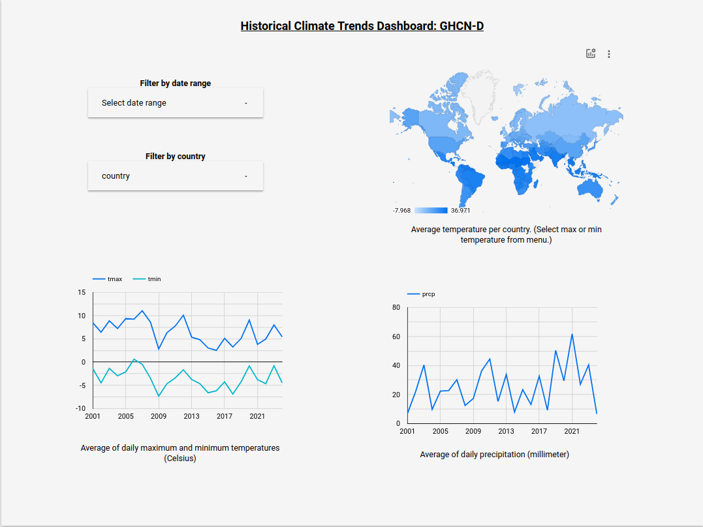

# Global Climate Insights Dashboard

## Problem Statement
Climate change is a pivotal global challenge impacting natural ecosystems, human
health, and economies.
Understanding historical climate trends is essential for predicting future
changes and formulating effective mitigation strategies.
This project aims to provide an accessible and comprehensive view of historical
climate data, highlighting trends, anomalies, and patterns in global weather
conditions.

## Final Dashboard
The Global Climate Insights Dashboard is an interactive platform for exploring
historical climate data from the Global Historical Climatology Network-Daily
(GHCN-D).
It features visualizations of temperature and precipitation trends, including
maximum, minimum, and average temperatures, alongside total precipitation over
time.
Users can drill down into specific time periods and geographical locations to
analyze climate behaviors and anomalies.

## Data Description
The dashboard utilizes data from the GHCN-D dataset, which comprises daily
climate observations from thousands of land surface stations worldwide.
Key metrics include:
- `TMAX`: Maximum temperature
- `TMIN`: Minimum temperature
- `TAVG`: Average temperature
- `PRCP`: Precipitation

The data is aggregated to present monthly and yearly trends, providing insights
into long-term climate patterns.

## Tech Stack
- **Data Storage and Processing**: Google Cloud Storage, Google BigQuery
- **Orchestration**: Mage.ai
- **Data Transformation**: dbt
- **Visualization**: Google Looker Studio

## Dashboard
You can find the dashboard [here](https://lookerstudio.google.com/u/0/reporting/641b285d-e2b9-4e29-a9e4-9ff6ca995c5b/page/cD4uD).

 